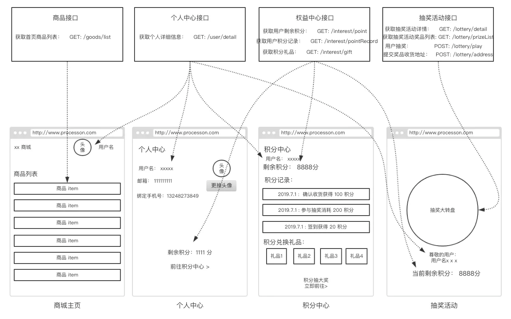
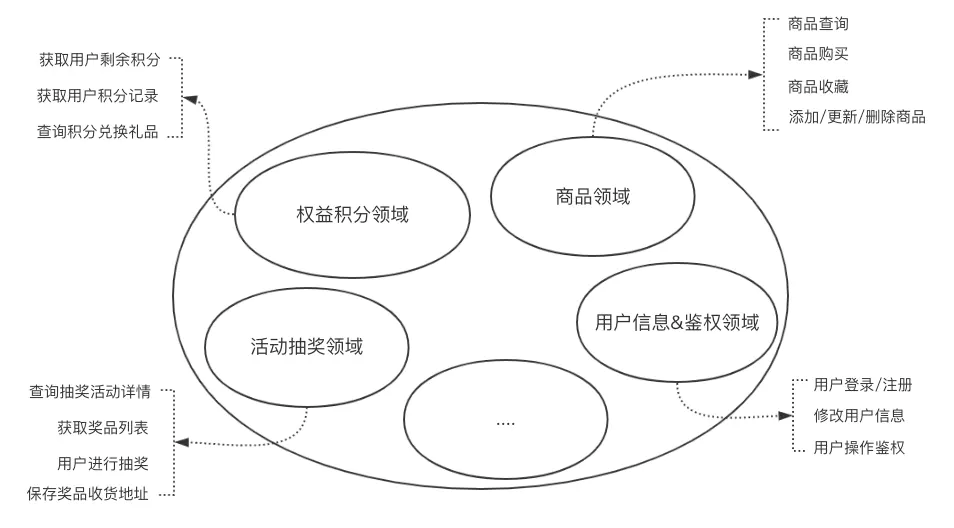
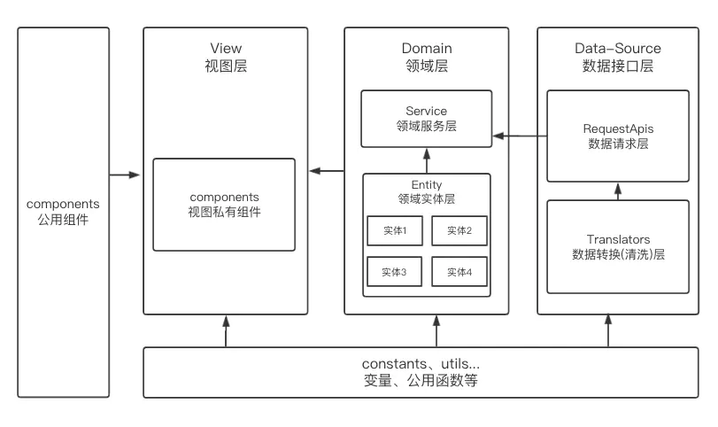

# 领域驱动设计在前端中的应用

## 垃圾桶现象

在开始本篇文章前，我给读者们分享一个很考验人性的有趣现象，在公司洗手间的洗漱台旁边，放置了一个垃圾桶，每次我洗完手，用纸巾擦干手后，将其扔进垃圾桶，但是偶尔扔不准会扔到垃圾桶外面。

一般情况下，我会将其捡起，再放入垃圾桶，心里想着：“不能破坏这么干净的环境呀”。

但是，当垃圾桶周边有很多别人没扔进去的餐巾纸时，我就不会那么愿意将自己没扔进去的餐巾纸再捡起来扔进去，想着：“反正都这么邋遢了，多了一个也不会怎样”。

万恶的人心呀！

过了很久，我接手了一个老的项目，这个项目经过近十个人手迭代，传到我这里时，已经是非常混乱的状态了，阅读代码时，发现了很多不合理的写法与隐藏式BUG，当我在写新的需求时，很自然地，我不会那么精益求精地编写业务逻辑，甚至也会留下一些隐藏的坑给后人。

恰恰相反，前段时间有幸接手一个大佬的项目，阅读其代码仿佛如沐春风，整个结构堪称完美，逻辑条理清晰，看代码就像看需求文档一样，堪称一绝。这个时候，当我要在其写新的需求，我会模仿其设计，小心翼翼地将自己代码插入其中，就像不忍心破坏这件艺术品一样。

以上故事纯属我一个理想主义程序员虚构。

但是回到现实当中，我们维护一个混乱项目和一个优雅项目的心情肯定是不一样的，就像上面讲的那个垃圾桶现象，混乱的项目就像周围遍布很多垃圾的垃圾桶，当你在混乱项目里再添加一些混乱代码后会良心也不会很痛，而优雅的项目你就会注意自己的行为，不能一颗老鼠屎坏了一锅粥。

## 前端开发面临的困难
这里我们讲到的困难并不是指技术细节实现层面上的困难，而是从整个软件开发过程中，遇到对高复杂度业务的开发困难，比如说很难从代码中直观地看出业务逻辑，项目经历不同人手迭代导致的逻辑书写规范不一致而进一步导致的后续人员理解成本高昂，说简单点，就是在高复杂度的业务之上，开发人员没有很强的意识去简化逻辑，将业务知识直接体现在代码中，我们具体从以下几个点来讲解这个问题。

### 业务逻辑本身错综复杂
这一点作为开发者是很难避免的，在一个项目中，必然会存在一些逻辑复杂的业务，初始开发者是最能够理解该业务的每个细节的，将业务映射成实际的代码过程中，复杂的业务转换成的代码肯定是也是复杂的，如何将其直面地转换成更易理解的代码，让后续维护者阅读代码就能大致理解其业务逻辑概貌，而进一步提升维护者开发的信心。
        
### 对全局业务理解不够透彻

一个项目在开发过程中人员变动是很正常的，可能是前人离职后人接手，也可能是新增人手，新人对业务的理解往往是不够透彻的，可能一来就直接评审接着就进入开发，比如新增了一个接口需要将数据展示在页面上，该需求前因后果并不知晓，这就形成了一种“面向页面”开发模式，对业务不熟悉，自然无法合适地将新的需求代码融入整个项目体系中。

### 知识在团队传播中的丢失

复杂的业务逻辑知识在团队中是很难传播的，在人员的变动后，更是支离破碎，业务知识丢失后，开发者就会陷入“不知在哪改、不敢改、不愿改”的泥淖中，最终导致业务开发不下去，推倒重来，严重影响整个项目的进展，我们在这里能做的，就是尽量将代码写成既能运行又能展示业务逻辑知识的形态，让后续的维护者更有信心的面对“知识丢失”这一困境。

### 团队无法形成统一逻辑代码书写规范

这里我指的书写规范并不是指 eslint 之类的 style 规范，而是书写业务逻辑的位置、方式、分层、复用等，比如 A 为了将应用隔离而习惯将接口写在 UI 层直接处理数据，B 习惯将接口写在 common 模块供自己或者别人在 UI 层调用，A 习惯将 util 类工具函数直接和 api 接口混在一起写，而 B 更愿意将 util 类函数写得更通用放在 common 模块，假如新来了开发者 C ， C 看到各式各样的风格就会很疑惑，不知应该按照 A 还是 B 或者按照自己的习惯书写，随着开发人员越来越多，直接会导致了整个项目逻辑书写规范的崩溃，维护者的维护信心会大打折扣。

## 真实业务案例

为了让读者能够更直观的理解领域驱动设计的思想，我们用一个多页面应用来举一些例子，同时为了体现出普通设计与领域驱动设计的区别，我们会用两种设计方式来实现同一需求，并且每个需求都由团队中的 A B C D 成员完成，成员的技术水平与代码风格各不相同，我们会分析在普通设计下，会出现哪些使得代码复杂度失控的行为。之后我们使用领域驱动设计的思维去重构该项目，再分析其设计方式如何让项目业务逻辑更清晰与更易维护。

### 案例需求分析

该需求为一个大型零售业务的 demo 版，请读者尽可能地将其想象为更为复杂的业务场景，该项目分为商品主页、个人中心页、积分中心页、抽奖活动页面，具体需求为：

- **A 成员**：主页为商品展示页面，这个页面展示推荐的商品列表，同时在页面的右上角，展示用户的头像与用户名。
- **B 成员**：实现用户的积分中心页面，该页面展示用户的剩余积分、积分记录列表、积分兑换礼品。
- **C 成员**：实现个人中心页面，个人中心展示了用户的详细信息，除此之外还需要展示用户积分中心的积分。
- **D 成员**：实现抽奖活动页面，用户在该页面能够使用积分中心中的积分进行抽奖，每次抽奖将会消耗100积分，中奖的奖品分虚拟奖品(优惠券、会员、积分)、实物奖品(需要用户填写收货地址)。


### 接口与原型图

具体业务需求原型图以及页面对接口的调用如图所示：



在上文中已经假设该项目会越来越庞大，所以为了更高效地开发我们将其设置成多页面应用，我们看到在写少量接口与页面的情况下，视图与不同领域的接口调用已经是非常混乱的，在实际代码中，这种混乱程度会因为上述讲到“前端开发面临的困难”中的问题而进一步放大，下一节我们将使用非常不规范的团队协作来实现整个项目。

## 不规范的代码设计

我们假设该团队中成员的规范意识不强烈，各有各的代码风格与分层习惯，这样的代码会写成怎样呢？

该项目我已经传到 Github 中，读者可访问：[ddd-fe-demo](https://github.com/Vincedream/ddd-fe-demo) clone 代码后执行以下操作启动项目：

```
// 切换到不规范写法的分支下
git checkout feature/normal

// 启动 mock 数据
npm run server

// 启动页面
npm run start
```

多页面应用，各页面url：

- 商城主页： http://localhost:3000/index.html
- 个人中心：http://localhost:3000/user.html
- 权益中心：http://localhost:3000/interest.html
- 抽奖活动页面：http://localhost:3000/lottery.html

### mock数据

这里我们用 mock 数据模仿后端的请求，下面是所以的数据接口，返回的数据请在`/ddd-fe-demo/server/*.js`中查看:

```
    // goods API
    'GET /goods/list' // 获取商品列表
    // user API
    'GET /user/detail' // 获取用户信息详情
    // ponit API
    'GET /interest/point' // 获取用户剩余积分
    'GET /interest/pointRecord' // 获取用户积分记录数据
    'GET /interest/gift' // 获取积分兑换奖品
    // lottery API
    'GET /lottery/detail' // 获取该抽奖活动的详情
    'GET /lottery/prizeList' // 获取奖品列表
    'POST /lottery/play' // 触发抽奖
    'POST /lottery/address' // 填写奖品收货地址
```

### 文件结构分析

```
├── common
│   └── util
│       └── http.js // 统一axios库
└── page
    ├── index // 商城主页目录
    │   ├── App.js
    │   ├── apis // 商城页面用到的api
    │   │   ├── goods.js
    │   │   └── user.js
    │   ├── components
    │   │   ├── GoodsItem.js
    │   │   ├── GoodsItem.scss
    │   │   ├── Nav.js
    │   │   └── Nav.scss
    │   └── index.js
    ├── interest // 积分权益页面目录
    │   ├── App.js
    │   ├── App.scss
    │   ├── apis // 商城页面用到的api
    │   │   ├── interest.js
    │   │   └── user.js
    │   ├── components
    │   │   ├── GiftItem.js
    │   │   ├── GiftItem.scss
    │   │   ├── PointRecordItem.js
    │   │   └── PointRecordItem.scss
    │   └── index.js
    ├── ....
```

## 细数存在的问题

这里我们通过贴出项目中的问题代码，来分析出一些存在问题，以及讨论其会导致的后果与优化的方案。

### 视图层过厚

**问题代码的位置：** `/src/page/index/components/GoodsItem.js`
``` javascript
return(
    <div className="goods-item">
        <div className="main-info">
                        
            <div className="goods-name">{goodsName}</div>
            {/* 当 status 为2时，表示无货 */}
            {status === 2
            ? <span className="out-stock">已无货</span>
            : null}
        </div>
        <div className="detail-info">
            {/* 当 activityType 为 3 表示该商品正在参与活动，为特价商品 */}
            {activityType === 3
            ? <span className="price discount">特价：{price / 100} 元</span>
            : <span className="price">价格：{price / 100} 元</span>}
            <div className="tag-wrap">
                {filterTag.map(v=>{
                    return (
                        <span className="tag">{v.title}</span>
                    )
                })}
            </div>
        </div>
    </div>
)
```
**存在的问题：** 视图层原本只需要展示 DOM 的结构，但这里却承担了各种逻辑判断、数据筛选、数据转换等“杂活”，视图代码与逻辑代码比例已经接近 1 : 1。

**导致的后果：** 难以直观地理解视图结构，并且在视图层写大段的注释显然是很不优雅。

**优化思路：** 视图层最好单一，数据展示到视图层之前，做好数据的筛选、转换，判断逻辑抽象层公用函数放入 util 中。

### 判断逻辑重复

**问题代码位置：**  `src/page/index/components/Nav.js` & `src/page/user/App.js`

``` javascript
<div className="user">
    
    <span>{userInfo.userType === 2 ? '尊敬的签约客户：' : null}{userInfo.userName}</span>
</div>
```

``` javascript
<div>{userType === 2 ? '尊敬的签约客户：' : null}{userName}</div>
```
**存在的问题：** 同样的逻辑在两个视图层中重复出现，这是团队协作经常会遇到的问题，假设例子中的逻辑较假设非常复杂的，各成员实现方式不一致，在后期维护将会造成许多问题。

**导致的后果：** 
- 违反了代码重复原则，后期需要统一修改时，涉及文件多成本大。
- 团队中各成员形成“知识不同步”,同样的功能 A B 都实现了，但是互相却不知道，并且容易出现因实现方案不同导致的结果不一致的问题。

**优化思路：** 试图将某个实体抽象成一个类，比如将用户抽象成 User 类，类中有一个方法为 isContractUser 用来判断用户是否为签约客户，之后视图层只需要调用 `User.isContractUser()` 便能够复用这块逻辑，并且容易理解其含义。

### 接口调用不统一

**问题代码位置：** `src/page/index/apis/user.js` & `src/page/lottery/apis/user.js` & `src/page/user/apis/user.js`

``` javascript
import axios from '@common/util/http';

export function getUserInfo() {
    return axios('/user/detail');
}
```

**存在问题：** 多块业务页面用到了同一个接口，并且在各自的根目录下都有一份相同的请求代码。作为成员，可能有这样的辨词：“我怕他改动了这个接口的参数配置会导致我的页面出问题，为了相互隔离而将其复制一份”，虽然有道理，但是这不是最优解。

**导致的后果：** 非常直观地后果就是代码重复不优雅，修改一块业务却找到了很多相同的请求逻辑，容易搞混，并且接口发生变化后，统一维护的成本较大。

**优化思路：** 将整个项目中所有的请求函数统一放在 commom 中管理，根据领域划分，比如说用户领域下，存放用户相关的接口，接口函数尽量可配置、可拓展，供多个业务使用。

### 接口字段不可控性

**问题代码：** `src/page/user/App.js`

``` javascript
getUserInfo().then(data => {
    this.setState({
        userInfo: data
      })
    })
}
getUserPonitCount = () => {
    getUserPointCount().then(count => {
      this.setState({
        pointCount: count
      })
    })
}
render() {
    const { userInfo, pointCount } = this.state;
    // vip 单从字面上难以辨别出是一个bool类型，更规范的命名应该是 isVip
    // avatar 是一个 url 类型的字段，更规范的写法应该是 avatarUrl 会更直观
    const { avatar, userName, userType, tel, vip, email, vipValidityDate } = userInfo;
```

**存在的问题：** 定义字段在理想的情况下是前端主导，且前后端有共同的认知，但是不排除特殊情况下接口字段定义混乱且不直观。

**导致的后果：** 阅读代码时，接口字段不规范，在视图层展示时，会导致误解或者难以理解的代码逻辑。

**优化思路：** 将接口层抽离出来，在接口返回时，逐一将字段列举出来，将不符合规范的字段进行纠正，转换成更易理解的词语，甚至在这一层中就能将很多字段内容进行转换，比如后端返回的金额为分单位*100的整数，在这一层中即将其转换为浮点数，在视图层中即可直接使用。

### 忽略业务整体

**问题代码：** 上述整个项目例子。

**存在的问题：** 在一个庞大、多人协作的项目，作为其中一员很可能出现对整个系统理解不够，只知道自己负责的那几个页面，逐步恶化成“面向页面编程”。

**导致的后果：** 

这对整个项目的“成长”是不利的，会导致像上述举例代码中出现的“重复性”问题。假如开发者对整个项目有全局的了解，在编码时，会考虑更多的“可拓展性”与“预判未来性”，或者在接手其他成员负责的领域也会减少很多上手成本。

从业务的角度看，在需求评审的过程中，熟悉整体业务，会对其新的需求进行更深的思考，判断其对整个项目是否会有明显的“驱动”作用，而进一步考虑是否应该拒绝该需求或者提出更好的需求建议，避免成为产品经理说什么就做什么的“面向页面编程”工程师。

**优化思路：** 将每一块业务划分成不同的领域，各领域下包含哪些服务，每个页面调用的并不是 API 接口，而是各自领域的服务。

## 领域驱动设计

首先提出领域的角色是需求方，每一个需求都必将会映射到某个领域，比如“搜索商品”这个动作对应着商品中心域，“用户登录”对应着用户信息&鉴权域。从产品-后端-前端对其领域的划分认知都是一致的，这是各角色对其整个项目进行合作的基础，在一起讨论问题时，都知道对方讲述的信息是处在哪个域上。

在对领域具有统一认知的情况下，需求方也会更谨慎、清晰地提出新的需求或是更改业务逻辑，各方人员对其业务的熟悉后，也能从自己负责的职能角度上表达出自己对新业务新迭代的看法或建议，而不是“机械”地根据需求文档完成自己的职责。

假设各方角色对整体业务领域不熟悉，大家对其业务的认知不统一，项目很快就会成为一个松散的结构，需求方、开发方、设计方的产出模型无法大致匹配，最后成为开发/维护代价极高的“危楼”项目。

领域驱动设计不是万能的，它只是解决了软件开发中的部分问题，也不是可适用于任何场景的，但是其核心思想是可以借鉴到软件设计与开发过程中的，本文主要讲解领域驱动设计在前端中解决的问题以及核心思想。

### 业务领域

在庞大的项目中，领域是非常繁多的，在对领域进行划分时，我们需要与产品、后端进行统一。我理解的先后流程是：产品产出需求，需求被划分到已有或新的领域，后端接到需求根据其领域的划分产出接口文档，前端根据产品&后端的领域划分设计出前端的领域，三方大致统一领域划分后，各自对需求概念、名词认知统一，最后才进行代码的编写。

我们根据上述项目业务进行领域划分，得到以下领域模块图，每个具体的功能都明确对应唯一一块领域，产品、后端、前端对其都应该有一致的认知。



领域模块图是需要各方人员进行持续维护演进的，其存在的意义是加强了成员对业务的理解，让团队成员力量进行聚焦，共同思考业务，这样才能让项目走的更远、更稳。

### 前端领域设计与结构分层

回到前端开发的设计上，我们理解了上述讲解的业务领域的概念后，接着将其落实到前端开发中，我们重点需要理解的概念是`职责分明，合理分层`，根据上述提出的“问题代码”，我们希望在前端结构设计中能做到：

1. **视图层尽可能薄**： 获得的数据能够直接使用到视图层中，禁止在视图层中对数据进行转换、筛选、计算等逻辑操作。
2. **不写重复逻辑**：遇到相同的逻辑尽可能复用而不是重写，逻辑函数尽可能写成可拓展可维护，暴露给团队其他成员。
3. **不同职责的代码进行分层**：将不同职责代码合理分层，每层尽可能纯净，互不影响。
4. **前端字段不受后端影响**： 返回字段进行纠正，字段含义尽可能直观，在视图层使用时，能够更清晰地描述视图结构。
5. **可纵观全局领域**： 前端进行领域模块结构设计时，能够纵览整个项目下所有的领域，以及每个领域下具有的逻辑功能。

带着以上五个目的，我们以第一步的业务领域为基础，进行前端结构的分层，并且开始改造上文出现问题的项目。

改造后的项目在 [ddd-fe-demo](https://github.com/Vincedream/ddd-fe-demo) 中，请读者 clone 下来后，进行以下操作启动项目：

```
git checkout master
npm run server // 启动 mock 接口
npm run start // 启动前端服务
```

同样是访问以下 url 

- 商城主页： http://localhost:3000/index.html
- 个人中心：http://localhost:3000/user.html
- 权益中心：http://localhost:3000/interest.html
- 抽奖活动页面：http://localhost:3000/lottery.html

建议读者在开始下面内容阅读前，将改造后的源码大致阅读一遍，带着问题进入接下来的内容，会有更深的理解。

#### 项目结构图

为了让各层职责分明，视图层尽可能纯粹，我们将各功能块代码进行分层，得到以下层级：



分层之后明显地降低了项目的复杂度，将前端的业务逻辑代码与视图逻辑进行解耦。

#### 文件结构

我们根据上述结构图的分层思想，在实际项目中定义了以下的文件目录：

```
├── common
│   ├── components // 公用组件
│   ├── constants // 全局变量
│   │   ├── goods
│   │   │   └── index.js
│   │   ├── ...
│   ├── data-source // 数据接口层
│   │   ├── goods
│   │   │   ├── requestApis.js
│   │   │   └── translators.js
│   │   ├── ...
│   ├── domains // 领域层
│   │   ├── goods-domain
│   │   │   ├── entities // 实体
│   │   │   │   └── goods.js
│   │   │   └── goodsService.js // 领域Service服务
│   │   ├── ...
│   └── util // 公用函数
│       └── http.js
└── page // 页面视图层
    ├── index
    │   ├── App.js
    │   ├── components
    │   │   ├── GoodsItem.js
    │   │   ├── GoodsItem.scss
    │   │   ├── Nav.js
    │   │   └── Nav.scss
    │   ├── index.js
    │   └── services // 该页面需要用到的Service
    │       └── index.js
    ├── ...
```

#### 数据接口层 data-source

- requestApi：数据请求层，负责 http 请求，是项目中唯一与后端服务进行交流的一层。

代码位置： `src/common/data-source/interest/requestApis.js`
``` javascript
import axios from '@common/util/http';
src/common/data-source/interest/requestApis.js
import { pointRecordTranslator, pointGiftTranslator } from './translators'

export function getUserPointRecordList() {
    return axios('/interest/pointRecord').then(data => {
        return data.map(item => pointRecordTranslator(item));
    })
}

export function getInterestGiftList() {
    return axios('/interest/gift').then(data => {
        return data.map(item => pointGiftTranslator(item))
    })
}
```

**分层作用：** 在这一层中集结了 interest 领域下所有的接口函数，避免了数据接口分散到各个页面，统一存放更易管理，这里我们解决了上文提出的`接口调用不统一`问题。

- translator：数据清洗层，这层负责将后端返回的数据“清洗”，改造成更直观地字段(key)、更方便使用的数据(value)。

代码位置： `src/common/data-source/goods/translators.js`

``` javascript
export function goodsTranslator({
    id,
    goodsName,
    price,
    status,
    activityType,
    desc,
    brand,
    relatedModelId,
    mainPic,
    tag,
    relatedModelImg
}) {
    return {
        id,
        name: goodsName,
        price: (price / 100).toFixed(2),
        status,
        activityType,
        description: desc,
        brandName: brand,
        mainPicUrl: mainPic,
        tags: tag
    }
}
```

**分层作用：** 在这一层对接口字段、内容经过二次加工，避免了后端定义字段不规范、混乱对前端的影响，含义清晰、规范的字段在视图层使用时更具有表现力，这里我们解决了上文提出的`接口字段不可控性`问题。

数据接口层是整个项目的根基，提供了结构清晰、定义规范、可直接使用的数据。

#### 领域层 -> domain

领域层是整个项目的核心层，它掌管了所有领域下的行为与定义，它是整个项目中最能体现业务知识的一层。

- entity： 实体，是领域服务的载体，它定义了业务中某个个体的属性与方法，比如抽奖活动中的奖品、活动，这些都可以抽象为实体，它在全局领域中是唯一的，不可能在别的领域中存在相同的实体。

**代码位置：** `src/common/domains/lottery-domain/entities/lottery.js`

``` javascript
/**
 * 抽奖活动实体
 */
import dayjs from 'dayjs'
import { lotteryTypeMap } from '@constants/lottery'
class Lottery {
    constructor(lottery={}) {
        this.id = lottery.id
        this.name = lottery.name
        this.type = lottery.type
        this.startDate = lottery.startDate
        this.endDate = lottery.endDate
    }
    // 获取活动时间范围
    getLotteryTimeScope() {
        return `${dayjs(this.startDate).format("M月D日")} - ${dayjs(this.endDate).format("M月D日")}`
    }

    // 获取活动类型描述
    getLotteryType() {
        return this.type && lotteryTypeMap[this.type].title
    }
}

export default Lottery
```

在前端中，我们把它定义为一个 class 类，构造函数中初始化实体的属性，在类中定义了实体的方法，属性和方法的返回值主要是用于视图层中的直接展示，同一个实体的逻辑确保只在实体类中编写，在不同视图下可复用，这里我们解决了上文提出的`判断逻辑重复`的问题。

- service：领域服务层，这一层中定义了领域的行为，供视图层直接调用。

**代码位置：** `src/common/domains/lottery-domain/lotteryService.js`

``` javascript
import {
    getLotteryDetail,
    getPrizeList,
    playLottery,
    savePrizeAddress
} from '@data-source/lottery/requestApis';

import Prize from './entities/prize';
import Lottery from './entities/lottery';


class LotteryService {
    /**
     * 获取本次抽奖活动详情
     * @param {string} id 活动id
     */
    static getLotteryDetail(id) {
        return getLotteryDetail(id).then(lottery => new Lottery(lottery))
    }

    /**
     * 获取本次抽奖活动的奖品列表
     * @param {string} id 抽奖活动id
     */
    static getPrizeList(id) {
        return getPrizeList(id).then(list => {
            return list.map(item => new Prize(item));
        })
    }

    /**
     * 进行抽奖
     * @param {string} id 抽奖活动id
     */
    static playLottery(id) {
        return playLottery(id).then(result => {
            const { recordId, prize } = result;
            return {
                recordId,
                prize: new Prize(prize)
            }
        })
    }

    /**
     * 填写中奖的收货地址信息
     * @param {Object} param0 中奖记录id以及地址信息
     */
    static savePrizeAddress({ recordId, name, phoneNumber, address }) {
        const data = {
            recordId,
            name,
            phoneNumber,
            address
        }
        return savePrizeAddress(data)
    }
}

export default LotteryService
```

**分层作用：** 我们可以看到，Service 层连接了 entity 层与 data-source 层，接收后端返回的数据将其转换成具有属性与方法的 entity 实体类，供视图层直接进行展示。不仅如此，Service 层还定义了该领域下的所有行为，比如填写收货地址。领域服务层涵盖了整个业务领域的行为，直观地体现了业务需求。这里我们解决了上文提出的`忽略业务整体`问题。

#### View 视图层 -> view

视图层也就是我们书写交互逻辑、样式的一层，可以使用纯 HTML 或者框架(React、Vue)，这一层只需要调用了领域的服务，将返回值直接体现在视图层中，无需编写条件判断、数据筛选、数据转换等与视图展示无关的逻辑代码，这些“糙活”都在其他层中以已经完成，所以视图层是非常“薄”的一层，只需关注视图的展示与交互，整个 HTML 结构非常直观清晰。

**代码位置：** `src/page/user/App.js`

``` javascript
import React from 'react';

import { UserService, InterestService } from './services';
import User from '@domain/user-domain/entities/user';
import { SIGN_USER_TYPE } from '@constants/user';

import "./App.scss"

class App extends React.Component {
  state = {
    pointCount: null,
    user: new User()
  }
  componentDidMount() {
    this.getUserInfo();
    this.getUserPonitCount();
  }
  // 获取用户信息
  getUserInfo = () => {
    UserService.getUserDetail().then(user => {
      this.setState({
        user
      })
    });
  }
  // 获取用户积分
  getUserPonitCount = () => {
    InterestService.getUserPointCount().then(count => {
      this.setState({
        pointCount: count
      })
    })
  }
  render() {
    const { pointCount, user } = this.state;
    return (
      <div className="user-page">
        <h3>个人中心</h3>
        <div className="user">
          <div className="info">
            <div>{user.type === SIGN_USER_TYPE ? `尊敬的${user.getUserTypeTitle()}：` : null}{user.name}</div>
            <div>绑定手机号： {user.phoneNumber}</div>
            <div>绑定email： {user.email}</div>
          </div>
          <div className="avatar">
            
            { user.isNeedRemindUserVipLack() && user.isVip
              ? <div>会员还有{user.getVipRemainDays()}天</div>
              : ''
            }
          </div>
        </div>

        <div className="lottery-tips">
          <div>剩余积分：{pointCount} 分</div>
          <a href="/interest.html">前往积分权益中心 ></a>
        </div>
      </div>
    );
  }
}

export default App;

```

我们可以对比之前写的“问题代码”： 

``` javascript
  render() {
    const { userInfo, pointCount } = this.state;
    const { avatar, userName, userType, tel, vip, email, vipValidityDate } = userInfo;
    // console.log()
    const remainDay = dayjs(vipValidityDate).diff(new Date(), 'day');
    return (
      <div className="user-page">
        <h3>个人中心</h3>
        <div className="user">
          <div className="info">
            <div>{userType === 2 ? '尊敬的签约客户：' : null}{userName}</div>
            <div>绑定手机号： {tel}</div>
            <div>绑定email： {email}</div>
          </div>
          <div className="avatar">
            
            { remainDay < 6 && vip
            ? <div>会员还有{remainDay}天</div>
            : ''
            }
          </div>
        </div>

        <div className="lottery-tips">
          <div>剩余积分：{pointCount} 分</div>
          <a href="/interest.html">前往积分权益中心 ></a>
        </div>
      </div>
    );
  }
```

**分层作用：** 将 Service 中返回的数据直接使用，视图层中只编写交互与样式，不管是 HTML 纯粹的结构还是代码可读性，新的设计都更讨人喜欢。除了视图层与前端框架有关，其他层可独立应用于任何框架的，分层的结构解决了上文提出的`视图层过厚`问题。

## 实践过程中的建议

### 坚定信仰
领域驱动设计的初衷是将项目进行合理地结构分层，降低复杂项目的维护难度，有效地减少团队成员之间的协作成本，将业务直观地映射成代码，让开发者更关注业务整体的本身，不局限于自己的职责，共同提出更好的业务建议，只有业务真正有价值了，你写的优秀代码才能保证被传承下去。

而一个复杂项目的生命周期是非常久的，可能长达几年，维护旧代码时间肯定会比编写新需求更长，为了后期能够爽快地维护，前期多付出写时间去改善代码结构与质量，从长远的角度来看，是非常值得的。就算中途离职，留给后人的代码也能做到问心无愧，更不会留下臭名昭著的名声。

所以，这里我想说的是，做一个更理想主义的程序员，坚定自己的信念，在实行领域驱动设计的初期或许会出现各种不适，甚至会受到冷嘲热讽，挺过了这段适应期后，就能体会到自己设计的结构与代码很丝滑很优雅。

### 团队成员实时同步

团队成员之间都需要熟悉全局的领域模型，特别是当需要修改他人负责领域下的代码，更是要熟悉其领域下的细节。当团队中加入了新的成员后，先向他介绍我们项目下的领域模型，再分享我们的项目架构与分层。

在另一方面，团队协作开发最不利的因素是闭门造车，大家都不知道对方做了什么、怎么做的，很常见的问题就是重复开发，建议团队指定间隔多久进行一次讨论，大家分享自己最近做了什么或者遇到了什么困难，或许自己的困惑其他人之前也遇到过并且有很好的解决方案。大家也可以一起吐槽需求方不合理的需求，听听大家的观点，说不定还能提高自己的业务思考能力。

既然选择了领域驱动设计，那么自然地要把自己融入到整个业务、整个项目中，把自己认定为项目中不可缺少的一部分，肩负了业务前进的重任。

### 严格的 Review

因为团队中各成员的能力水平、对领域驱动设计的领悟程度不一致，在初期可能会写出不规范的代码或者结构，甚至出现错误的领域划分，在合入分支前进行严格的 Code Review 是非常有必要的，领域驱动设计是非常不抗“腐蚀”的，不能接受不规范的代码或结构，在初期的 Review 成本或许有些大，等成员之间认知统一后，后续便能愉快地一起写代码了～

## 总结

本篇文章我们以一个很有趣的现象开头，结合有问题的代码分析出前端开发过程中遇到的困难，接着提出了领域驱动设计，结合其实践，逐一解决了之前遇到的困难，注意，上文实践的领域驱动结构并不是完全按照 Evans 在《领域驱动设计》书中提出的结构，因为该书中的结构更适合后端的实践，而在前端中，我们提取了书中部分优良的设计，与实际的前端开发场景进行结合而总结出上述结构，当然读者可以对其结构进一步的改造、优化，也期待读者与我进行交流，文中出现的错误欢迎指正。

领域驱动设计有效地降低了项目的复杂度，分层的结构让各功能代码职责分明，在前端中将其业务逻辑代码逐一分层，与视图层解耦，做到了真正的业务逻辑复用，在代码的可读性、可维护性上也有了质的提升。在业务上也让开发者更融入整个项目，加深了开发者对业务的理解，能够共同的促进业务的进步。

欢迎与我联系：artistcoder@163.com
